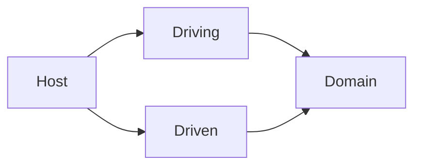

# Cherry Api

## Description

Cherries are a type of fruit.

## Architecture

This project follows [Hexagonal Architecture](https://en.wikipedia.org/wiki/Hexagonal_architecture_(software)) (ports & adapters).

The dependency direction is as follows:

## Proxy
This project uses [YARP](https://github.com/microsoft/reverse-proxy) as a reverse proxy.
The YARP project can be found in the [proxy directory](proxy).